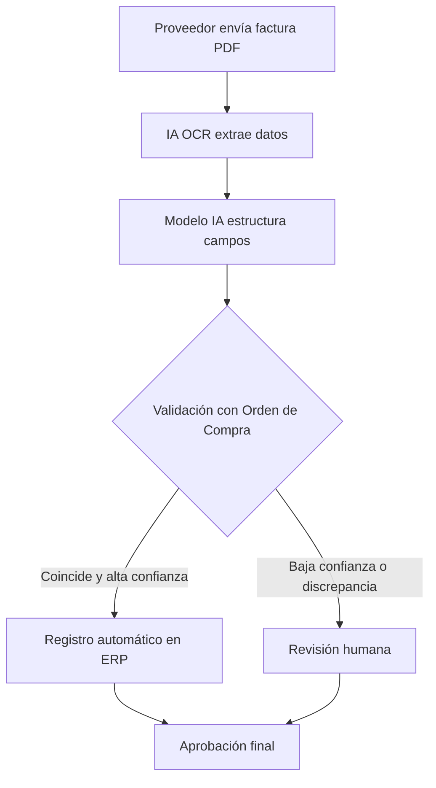

# Práctica IA (RA4 · a) — Automatización y optimización

## 1) Proceso elegido
- Nombre del proceso: Extracción automática de datos de facturas (Accounts Payable)
- Contexto (empresa/servicio web/IT): Empresa mediana que gestiona proveedores y recibe facturas en PDF por email
- Rol/es implicados:
    - Administrativo/a de contabilidad
    - Responsable financiero
    - Departamento de sistemas

## 2) ANTES (sin IA)
- Pasos (5–7):
    1. El proveedor envía la factura en PDF por correo electrónico.
    2. El administrativo descarga el archivo manualmente.
    3. Abre la factura y revisa los datos clave (CIF, importe, fecha, número de factura).
    4. Introduce manualmente los datos en el ERP.
    5. Adjunta el PDF al registro contable.
    6. Verifica que los importes coinciden con la orden de compra.
    7. Envía la factura a aprobación.

- Tiempo aproximado por caso: 10-15 minutos por factura.
- Problemas / cuellos de botella:
    - Errores de transcripción (≈5–8%).
    - Retrasos cuando hay alto volumen mensual.
    - Fatiga del personal administrativo.
    - Coste elevado en tareas repetitivas.
    - Riesgo de pagos incorrectos por error humano.

## 3) DESPUÉS (con IA)
- ¿Qué automatiza la IA?
    - Lectura automática del PDF mediante OCR.
    - Extracción estructurada de campos clave (NIF, fecha, importe, concepto).
    - Validación automática con la orden de compra.
    - Registro automático en el ERP.
- ¿Qué queda para humanos?
    - Revisión de facturas con baja confianza.
    - Gestión de discrepancias.
    - Aprobación final de pagos.
    - Auditoría periódica del sistema.
- Datos necesarios (tipos de datos, sin datos personales):
    - Facturas en PDF (texto e imagen).
    - Datos históricos etiquetados (campos correctos).
    - Órdenes de compra registradas.
    - Logs de validación y correcciones.
- Modelo/técnica (NLP, clasificación, recomendación, visión, etc.):
    - OCR avanzado (ej. tecnología similar a la usada por [Google Cloud Vision API]([https://cloud.google.com/vision/docs/ocr](https://chatgpt.com/c/699c3748-15a8-8397-be3d-ae32c082b3d9)).
    - Modelos de extracción de información (Information Extraction).
    - Modelos de lenguaje para comprensión contextual.

## 4) Optimización (mejora medible)
Define 3 métricas con valores antes/después:
- Tiempo:
    - Antes: 12 min por factura
    - Después: 2–3 min (solo revisión cuando aplica)
    - Mejora estimada: −75% en tiempo de procesamiento
- Coste:
    - Antes: 1 administrativo dedicando 4 h/día
    - Después: 1 administrativo dedicando 1 h/día
    - Reducción estimada: −60–70% coste en tarea repetitiva
- Calidad:
    - Antes: 92–95% exactitud (errores de tecleo)
    - Después: 98–99% exactitud en extracción validada
    - Reducción de errores de registro: −70%

## 5) Diagrama del flujo (ASCII o Mermaid)

## 6) Riesgos y mitigación
- Riesgo 1: Errores en facturas con formato no estándar
    - Facturas de nuevos proveedores pueden no ser reconocidas correctamente.
- Mitigación 1:
    - Umbral de confianza mínimo antes del registro automático.
    - Reentrenamiento continuo con nuevos formatos.
    - Revisión humana obligatoria en casos nuevos.

- Riesgo 2: Riesgos de seguridad y acceso indebido
    - Las facturas contienen información financiera sensible.
- Mitigación 2:
    - Cifrado en tránsito y en reposo.
    - Control de accesos por roles.
    - Cumplimiento del Reglamento General de Protección de Datos (RGPD).

## 7) Fuente oficial
- Enlace: Documentación oficial de OCR e IA aplicada a documentos — [Google Cloud]([https://www.google.com](https://cloud.google.com/vision/docs/ocr)):
