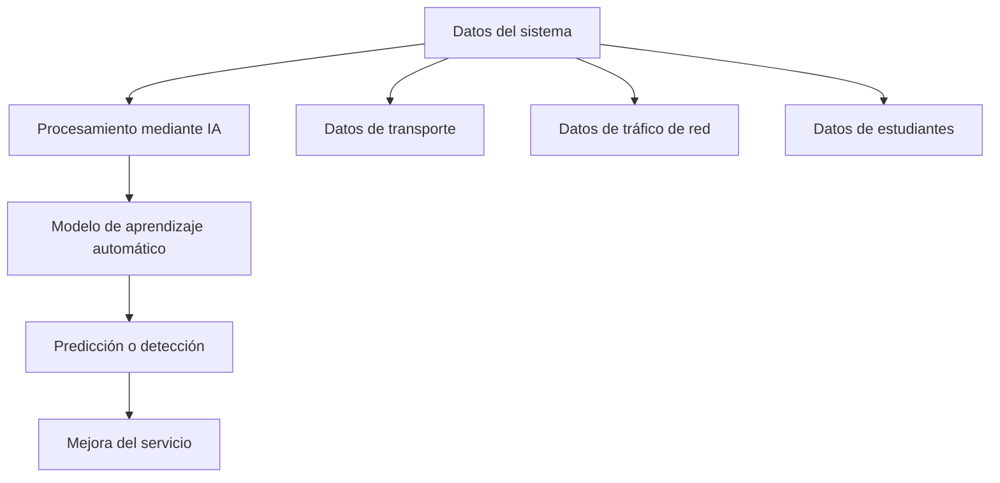

# Práctica IA (RA4 · d+e) — Sectores con implantación relevante y lenguajes de programación en IA

## 1) Introducción

**Objetivo de la práctica:**  
Analizar diferentes sectores donde la Inteligencia Artificial tiene una implantación relevante, identificar aplicaciones reales en cada sector y estudiar los lenguajes de programación más utilizados para desarrollar estas soluciones.

**Relación con DAW/DAM:**  
Los desarrolladores de aplicaciones web y multiplataforma pueden integrar sistemas de IA en aplicaciones modernas, como análisis de datos, automatización de procesos, detección de amenazas o plataformas educativas inteligentes.

---

# 2) Sectores con implantación relevante de IA

## Sector 1

- **Nombre del sector:** Logística  
- **Tipo de empresa/servicio:** Empresas de transporte, distribución de mercancías y gestión de almacenes.

- **Aplicación de IA:**  
Optimización de rutas de transporte y predicción de demanda.

- **Qué tarea mejora o automatiza:**  
La IA analiza datos de tráfico, condiciones meteorológicas y volumen de pedidos para calcular las rutas más eficientes y prever la demanda futura.

- **Por qué la IA tiene implantación relevante en este sector:**  
La logística depende de la eficiencia en el transporte y la gestión de inventarios. La IA permite analizar grandes cantidades de datos para mejorar la planificación.

- **Beneficios que aporta:**
  - Reducción de costes de transporte
  - Entregas más rápidas
  - Mejor planificación logística

---

## Sector 2

- **Nombre del sector:** Ciberseguridad  
- **Tipo de empresa/servicio:** Empresas de seguridad informática, consultoras tecnológicas y departamentos de seguridad de organizaciones.

- **Aplicación de IA:**  
Detección de anomalías y amenazas informáticas.

- **Qué tarea mejora o automatiza:**  
Los sistemas de IA analizan el tráfico de red y el comportamiento de los usuarios para detectar actividades sospechosas, malware o intentos de intrusión.

- **Por qué la IA tiene implantación relevante en este sector:**  
Las amenazas informáticas evolucionan constantemente y generan grandes volúmenes de datos que deben analizarse en tiempo real.

- **Beneficios que aporta:**
  - Detección temprana de ataques
  - Mayor protección de sistemas informáticos
  - Automatización del análisis de amenazas

---

## Sector 3

- **Nombre del sector:** Educación  
- **Tipo de empresa/servicio:** Plataformas educativas online, universidades, academias y sistemas de aprendizaje digital.

- **Aplicación de IA:**  
Sistemas de aprendizaje personalizado.

- **Qué tarea mejora o automatiza:**  
La IA analiza el progreso de los estudiantes y adapta el contenido educativo según su nivel y ritmo de aprendizaje.

- **Por qué la IA tiene implantación relevante en este sector:**  
Las plataformas educativas digitales generan muchos datos sobre el comportamiento de los estudiantes que pueden usarse para mejorar el aprendizaje.

- **Beneficios que aporta:**
  - Educación personalizada
  - Mejora del rendimiento académico
  - Mayor accesibilidad al aprendizaje

---

# 3) Lenguajes de programación en IA

## Lenguaje 1

- **Nombre:** Python  
- **Uso principal en IA:**  
Desarrollo de modelos de machine learning y análisis de datos.

- **Ventajas:**
  - Sintaxis sencilla
  - Gran cantidad de librerías de IA
  - Amplia comunidad

- **Ejemplos de uso:**
  - Predicción de demanda en logística
  - Sistemas de detección de amenazas
  - Plataformas educativas inteligentes

---

## Lenguaje 2

- **Nombre:** JavaScript  

- **Uso principal en IA:**  
Integración de funcionalidades de IA en aplicaciones web.

- **Ventajas:**
  - Funciona directamente en el navegador
  - Compatible con aplicaciones web modernas
  - Permite crear interfaces interactivas

- **Ejemplos de uso:**
  - Chatbots educativos
  - Sistemas de recomendación en plataformas web
  - Visualización de datos de IA

---

## Lenguaje 3

- **Nombre:** Java  

- **Uso principal en IA:**  
Desarrollo de sistemas empresariales con procesamiento de grandes volúmenes de datos.

- **Ventajas:**
  - Alta escalabilidad
  - Gran estabilidad
  - Integración con sistemas corporativos

- **Ejemplos de uso:**
  - Sistemas de seguridad informática
  - Plataformas de análisis de datos
  - Infraestructuras empresariales

---

## Lenguaje 4

- **Nombre:** C++  

- **Uso principal en IA:**  
Desarrollo de sistemas que requieren alto rendimiento.

- **Ventajas:**
  - Muy rápido
  - Control directo del hardware
  - Ideal para sistemas en tiempo real

- **Ejemplos de uso:**
  - Sistemas de detección de intrusiones
  - Software de optimización logística
  - Procesamiento avanzado de datos

---

# 4) Relación entre sectores, tipo de IA y lenguaje

| Sector | Aplicación de IA | Tipo de IA/técnica | Lenguaje recomendado | Justificación |
|------|------------------|-------------------|---------------------|---------------|
| Logística | Optimización de rutas | Machine Learning / predicción | Python | Permite analizar grandes cantidades de datos de transporte |
| Ciberseguridad | Detección de amenazas | Análisis de anomalías | Java / Python | Permiten procesar datos de red en tiempo real |
| Educación | Aprendizaje personalizado | Sistemas de recomendación | JavaScript / Python | Facilita integrar IA en plataformas educativas web |

---

# 5) Diagrama (Mermaid)

6) Riesgos y mitigación

Riesgo 1:
Dependencia tecnológica de sistemas automatizados.
Mitigación 1:
Mantener supervisión humana y planes de respaldo en caso de fallos.

Riesgo 2:
Falta de datos de calidad para entrenar los modelos.
Mitigación 2:
Aplicar procesos de control y validación de datos antes de entrenar los sistemas de IA.

7) Conclusión

- Qué sectores destacan más:
  La logística, la ciberseguridad y la educación están adoptando rápidamente la IA para optimizar procesos, mejorar la seguridad y personalizar el aprendizaje.
- Qué lenguajes aparecen con más frecuencia:
  Python sigue siendo el lenguaje más utilizado en IA, aunque JavaScript y Java también son importantes para integrar la inteligencia artificial en aplicaciones reales.
- Qué importancia tiene esto para DAW/DAM:
  Los desarrolladores pueden crear aplicaciones inteligentes que integren análisis de datos, detección automática de problemas o sistemas educativos personalizados.

8) Fuentes oficiales (mín. 2)

Fuente 1 (sectores / aplicación IA):
European Commission – [Artificial Intelligence](https://digital-strategy.ec.europa.eu)

Fuente 2 (lenguajes / ecosistema técnico):
[Python Software Foundation](https://www.python.org)
